Lab 1: High Availability & Efficient Load Distribution
==========================================================================================

Business problem. AI pipelines need consistent, high‑throughput access to S3-compatible storage. Wiring
clients directly to specific storage nodes creates tight coupling and operational risk: a single overloaded node
throttles the entire pipeline.

Technical problem. Without a delivery layer, clients must pick a node, handle retries/failover, and live with
uneven utilization (hot spots) and brittle endpoints.

Solution with BIG‑IP LTM. Expose a single, resilient virtual endpoint. Behind this VIP, BIG‑IP intelligently
distributes S3 traffic across all healthy MinIO nodes and lets you scale by simply adding/removing pool
members—no client changes required. Use Least Connections to smooth throughput for S3 workloads.

Following the tasks in the prior **Introduction** Section, you should now be able to access the
UDF lab environment.

Task 1: Review the Lab Environment
~~~~~~~~~~~~~~~~~~~~~~~~~~~~~~~~~~~~~~~~~~~~~~~

These values align with the UDF topology. Keep them unchanged unless your
environment differs.

======================== ========================================= ==================================
Component                Purpose                                   Where to access
======================== ========================================= ==================================
MinIO Cluster‑1 (direct) Baseline test without BIG‑IP              WARP parameters: 10.1.10.100:9000
------------------------ ----------------------------------------- ----------------------------------
BIG‑IP VIP for Cluster‑1 Single front door with LTM load           WARP parameters: 10.1.40.160:9000
------------------------ ----------------------------------------- ----------------------------------
MinIO Console            Review node-level metrics                 UDF → Cluster1-Node1 → Access → UI
------------------------ ----------------------------------------- ----------------------------------
BIG‑IP TMUI              Verify pools/members & methods            UDF → BIG‑IP → Access → TMUI
======================== ========================================= ==================================
      

Task 2: Baseline: Send traffic directly to MinIO (no BIG‑IP)
~~~~~~~~~~~~~~~~~~~~~~~~~~~~~~~~~~~~~~~~~~~~~~~~~~~~~~~~~~

The following steps will validate access to the application via web browser, review the
Performance Monitoring dashboard, and gather request details.

+---------------------------------------------------------------------------------------------------------------+
| 1. Open MinIO WARP (UDF → Components → Traffic‑Gen → Access → Firefox).  The credentials are under lab        |
|    Documentation tab (admin/admin).  If presented with Firefox "Restoring Pages" message, choose "Restore     |
|    Session" button.   As well, permit the pop-up to allow access to clipboard.                                |
|                                                                                                               |
| 2. Select the cluster‑1 profile.                                                                              |
|                                                                                                               |
| 3. Select all 3 buckets, when selected for use they will appear in bright orange.                             |
|                                                                                                               |
| 4. Set Duration to 3 minutes and Concurrency to 20 threads. Conncurrency refers to parallel S3 transactions.  |
|                                                                                                               |
| 5. In WARP Parameters, set Endpoint to 10.1.10.100:9000.                                                      |
|                                                                                                               |
| 6. Click Run Benchmark.                                                                                       |
+---------------------------------------------------------------------------------------------------------------+
| |lab014|                                                                                                      |
|                                                                                                               |
|                                                                                                               |
+---------------------------------------------------------------------------------------------------------------+

+---------------------------------------------------------------------------------------------------------------+
| 7. Open MinIO cluster‑1 Console (UDF → Cluster1‑Node1 → Access → UI). Login: minioadmin / minioadmin          | 
|                                                                                                               |
| 8. Observe that there are 4 AIStor servers spread across 2 clusters, however data charts require normally     |
|    30 minutes or more to popluate so expect no traffic on the right-hand chart.                               |
+---------------------------------------------------------------------------------------------------------------+
| |lab016|                                                                                                      |
|                                                                                                               |
|                                                                                                               |
+---------------------------------------------------------------------------------------------------------------+

+---------------------------------------------------------------------------------------------------------------+
| 9.  Click on the arrow next to time to first byte, in the lower right of the screen.                          | 
|                                                                                                               |
| 10. Observe that once the charts populate, only traffic will be registered with only the first AIStor,        |
|     at address 10.1.10.100 port 9000.  This traffic will task one server, creating a hot spot of load.        |
+---------------------------------------------------------------------------------------------------------------+
| |lab017|                                                                                                      |
|                                                                                                               |
|                                                                                                               |
+---------------------------------------------------------------------------------------------------------------+

Why this matters:  Clients that target a single node are brittleutilization is uneven and scalability suffers. 

Task 3: Baseline: Steer (proxy) the Same Workload through BIG-IP
~~~~~~~~~~~~~~~~~~~~~~~~~~~~~~~~~~~~~~~~~~~~~~~~~~~~~~~~~~~~~~~

+---------------------------------------------------------------------------------------------------------------+
| 1. In WARP, switch target to the BIG‑IP VIP profile BigIP‑cluster‑1.                                          |
|                                                                                                               |
| 2. Set Duration: 5 minutes (300 seconds), Concurrency: 20 threads.                                            |
|                                                                                                               |
| 3. In WARP Parameters, set Endpoint to 10.1.40.160:9000.                                                      |
|                                                                                                               |
| 4. Click Run Benchmark                                                                                        |
|                                                                                                               |
| 5. Log into BIG-IP TMU: Local Traffic → Pools → Cluster‑1.  Confirm 3 pool members are present initially      |
|    Click both Members and Statistics tabs.                                                                    |
|                                                                                                               |
| .. note::                                                                                                     |
|      *due to short run durations, summary analytics may not have appeared in the AIStor dashboard view yet.*  |
+---------------------------------------------------------------------------------------------------------------+
| |lab018|                                                                                                      |
|                                                                                                               |
| |lab019|                                                                                                      |
+---------------------------------------------------------------------------------------------------------------+

+---------------------------------------------------------------------------------------------------------------+
| 6. Confirm the WARP S3 load generator has run to completions, traffic settings can be seen below.             |
|                                                                                                               |
|                                   |                                                                           |
+---------------------------------------------------------------------------------------------------------------+
| |lab020|                                                                                                      |
|                                                                                                               |
| |lab021|                                                                                                      |
+---------------------------------------------------------------------------------------------------------------+

**Expected outcome**: Traffic is distributed across the **three** nodes behind the VIP.

**Load‑balancing method**: This pool is configured for Least Connections, recommended for S3‑style
workloads to reduce request skew.

Task 4: Scale out easily: add the 4th MinIO AIStor node to the pool
~~~~~~~~~~~~~~~~~~~~~~~~~~~~~~~~~~~~~~~~~~~~~~~~~~~~~~~~~~~~~~~~~~~

+---------------------------------------------------------------------------------------------------------------+
| 1. In BIG‑IP TMUI: Local Traffic → Pools → Cluster‑1 → Members.  Add a New member and choose Node List menu.  |
|                                                                                                               |
+---------------------------------------------------------------------------------------------------------------+
| |lab041|                                                                                                      |
|                                                                                                               |
|                                                                                                               |
+---------------------------------------------------------------------------------------------------------------+

+---------------------------------------------------------------------------------------------------------------+
| 2. Click **Add.... -> Node List ->** select cl1-nd4                                                           |
|                                                                                                               |
| 3. Set **Service Port** to 9000 and click **Finished**                                                        |                                             
|                                                                                                               | 
|  .. note::                                                                                                    |
|      health checks for the new member will drive the LED from blue to green (ready) shortly                   |
+---------------------------------------------------------------------------------------------------------------+
| |lab042|                                                                                                      |
|                                                                                                               |
|                                                                                                               |
+---------------------------------------------------------------------------------------------------------------+

+---------------------------------------------------------------------------------------------------------------+
| 4. Re-run the WARP workload targetting the BIG-IP Virtual IP (VIP 10.1.40.160:9000)                           |                                                                                                  
|                                                                                                               | 
|  .. note::                                                                                                    |
|      The 4th AIStor node begins processing traffic **immediately**.  All nodes now share load                 |
+---------------------------------------------------------------------------------------------------------------+
| |lab043|                                                                                                      |
|                                                                                                               |
| |lab044|                                                                                                      |
|                                                                                                               |
+---------------------------------------------------------------------------------------------------------------+

**Key Takeaway** There were no client changes and Applications still continue to talk to the same VIP;
topology changes are absorbed by *BIG‑IP* at the dataplane.

Task 5:  Verify the load‑balancing method & pool health
~~~~~~~~~~~~~~~~~~~~~~~~~~~~~~~~~~~~~~~~~~~~~~~~~~~~~~~

The following steps will guide you through the rich, visual metrics presented for BIG-IP through the AST
dashboards powered by Grafana.   We will verify the load balancing method and pool health.

+---------------------------------------------------------------------------------------------------------------+
| 1. In BIG‑IP TMUI: Local Traffic → Pools → Cluster‑1.                                                         |
|                                                                                                               |
| 2. Confirm Load Balancing Method: Least Connections.                                                          |
|                                                                                                               |
| 3. Check Members tab:  All members green (up) with active connections.                                        |
|                                                                                                               |
| 4. Use the AST tool (to review the Dashboards) UDF -> AST -> Access -> Grafana.                               |
|    Login as admin / admin, when prompted to change password retain the value as admin                         |
|                                                                                                               |
| 5. In **AST: Dashboards → BigIP - Device → Device Pools** look at the key metrics, such as Active Pool        |
|            Connections.   For "Pool" in top menu, adjust to "Cluster-1" and examine last 15 minutes.          |
|                                                                                                               |
| 6.  Click on the "3 dots" menu → View to see the full stats.    Use the "Refresh" button often in top right.  |
|                                                                                                               |
|                                                                                                               |
|                                                                                                               |
|                                                                                                               |
+---------------------------------------------------------------------------------------------------------------+
| |lab045|                                                                                                      |
|                                                                                                               |
+---------------------------------------------------------------------------------------------------------------+

+---------------------------------------------------------------------------------------------------------------+
| 1. Following **Task 2**, you should have the **Multi-Cloud App Connect** navigation panel on the left of your |
|    console.  If for some reason you do not see the **Multi-Cloud App Connect** navigation panel, use the      |
|    **Select Workspace** dropdown at the top left, and click **Multi-Cloud App Connect** as shown in the       |
|    *Introduction section, Task 2, Step 9*.                                                                    |
|                                                                                                               |
| 2. In the left-hand navigation expand **Manage** and click **Load Balancers > HTTP Load Balancers**           |
|                                                                                                               |
| 3. On the resulting page find the HTTP Load Balancer created in **Task 1** *(<namespace>-lb)*.  Click the     |
|    ellipsis under Actions and select **Manage Configuration**.                                                |
+---------------------------------------------------------------------------------------------------------------+
| |lab028|                                                                                                      |
|                                                                                                               |
| |lab029|                                                                                                      |
+---------------------------------------------------------------------------------------------------------------+

+---------------------------------------------------------------------------------------------------------------+
| 4. On the resulting page click **Edit Configuration**.                                                        |
|                                                                                                               |
| 5. Click **Web Application Firewall** in the left-hand navigation.                                            |  
+---------------------------------------------------------------------------------------------------------------+
| |lab030|                                                                                                      |
|                                                                                                               |
| |lab031|                                                                                                      |
+---------------------------------------------------------------------------------------------------------------+

+---------------------------------------------------------------------------------------------------------------+
| 6. Under the **Web Application Firewall** section select **Enable** from the **Web Application Firewall**     |
|     **(WAF)** dropdown.                                                                                       |
|                                                                                                               |
| 7. Select preconfigured the Web Application Firewall                                                          |
|     *(shared/base-appfw)* from the **Enable** dropdown.                                                       |
|                                                                                                               |
| 8. Scroll to the bottom of the page and click **Save and Exit**                                               |
+---------------------------------------------------------------------------------------------------------------+
| |lab032|                                                                                                      |
|                                                                                                               |
| |lab033|                                                                                                      |
+---------------------------------------------------------------------------------------------------------------+

Task 4. Route the same workload through BIG‑IP VIP
~~~~~~~~~~~~~~~~~~~~~~~~~~~~~~~~~~~~~~~~~~~~~~~~~~~~~~~~~~~~~~

The following steps will test and validate the Web Application Firewall, review the Security

Monitoring dashboard, and gather security event details.

+---------------------------------------------------------------------------------------------------------------+
| 1. Open another tab in your browser (Chrome shown), navigate to the newly configured Load Balancer            |
|    configuration: **http://<namespace>.lab-sec.f5demos.com**, to confirm it is functional.                    |
|                                                                                                               |
| 2. Using some of the sample attacks below, add the URI path & variables to your application to generate       |
|    security event data.                                                                                       |
|                                                                                                               |
|    * /?cmd=cat%20/etc/passwd                                                                                  |
|    * /product?id=4%20OR%201=1                                                                                 |
|    * /cart?search=aaa'>                                 |
|                                                                                                               |
| .. note::                                                                                                     |
|    *The web application firewall is blocking these requests to protect the application. The block page can*   |
|    *be customized to provide additional information.*                                                         |
+---------------------------------------------------------------------------------------------------------------+
| |lab034|                                                                                                      |
+---------------------------------------------------------------------------------------------------------------+

+---------------------------------------------------------------------------------------------------------------+
| 3. Returning to the F5 Distributed Cloud Console, use the left-hand navigation to navigate to Multi-Cloud App |
|    Connect section and click on **Performance**                                                               |
|                                                                                                               |
| 4. Scroll to the **Load Balancers** section of the page and click the link for your respective load balancer. |
+---------------------------------------------------------------------------------------------------------------+
| |lab016|                                                                                                      |
|                                                                                                               |
|                                                                                                               |
+---------------------------------------------------------------------------------------------------------------+

+---------------------------------------------------------------------------------------------------------------+
| 5. Click the **Performance Monitoring** dropdown at the top of the page and select **Security Monitoring**    |
+---------------------------------------------------------------------------------------------------------------+
| |lab035|                                                                                                      |
+---------------------------------------------------------------------------------------------------------------+

+---------------------------------------------------------------------------------------------------------------+
| 6. From the **Dashboard** view, using the horizontal navigation, click **Security Analytics**.                |
|                                                                                                               |
| 7. Note the **Chart** shows a graphical representation of all of the response codes for the selected time     |
|    frame.                                                                                                     |
|                                                                                                               |
| .. note::                                                                                                     |
|    *If you lost your 1 Hour Filter, re-apply using Task 2: Step 5*                                            |
+---------------------------------------------------------------------------------------------------------------+
| |lab037|                                                                                                      |
|                                                                                                               |
| |lab038|                                                                                                      |
+---------------------------------------------------------------------------------------------------------------+

+---------------------------------------------------------------------------------------------------------------+
| 8. Click the **Hide Chart** link to free up space in the browser window.                                      |
|                                                                                                               |
| 9. Expand your latest security event as shown.                                                                |
|                                                                                                               |
| 10. Note the summary detail provided in the **Information** link.  The **req_id** which is synonymous with    |
|    **Support ID** (filterable) from the block page.                                                           |
|                                                                                                               |
| 11. Scroll to the bottom of the information screen to see specific signatures detected and actions taken      |
|     during the security event.                                                                                |
|                                                                                                               |
| .. note::                                                                                                     |
|    *Note that Requests have additional detail in JSON format*                                                 |
+---------------------------------------------------------------------------------------------------------------+
| |lab039|                                                                                                      |
|                                                                                                               |
| |lab040|                                                                                                      |
|                                                                                                               |
| |lab041|                                                                                                      |
+---------------------------------------------------------------------------------------------------------------+

+---------------------------------------------------------------------------------------------------------------+
| 12. Scroll back to the top and on the right-hand size under Actions click "...". Now click "Explain with AI". |
|     F5 Distributed Cloud AI Assistant will provide additional information about the security event including  |
|     an analysis of the event, recommended follow-up actions, and more detection details should you need to    |
|     investigate further.                                                                                      |
+---------------------------------------------------------------------------------------------------------------+
| |lab042|                                                                                                      |
|                                                                                                               |
| |lab043|                                                                                                      |
+---------------------------------------------------------------------------------------------------------------+

Task 5.  Scale out: add the 4th MinIO node to the pool
~~~~~~~~~~~~~~~~~~~~~~~~~~~~~~~~~~~~~~~~~~~~~~~~~~~~~~~~~~~~~~

The following steps will test and validate the Web Application Firewall, review the Security

Task 6.   Verify the load‑balancing method & pool health
~~~~~~~~~~~~~~~~~~~~~~~~~~~~~~~~~~~~~~~~~~~~~~~~~~~~~~~~~~~~~~

The following steps will test and validate the Web Application Firewall, review the Security

Task 7.   Validation with MinIO Console 
~~~~~~~~~~~~~~~~~~~~~~~~~~~~~~~~~~~~~~~~~~~~~~~~~~~~~~~~~~~~~~

The following steps will test and validate the Web Application Firewall, review the Security

+---------------------------------------------------------------------------------------------------------------+
| **End of Lab 1:**  This concludes Lab 1.  In this lab you created an origin pool to connect to the            |
| application, you then created a load balancer and associated the origin pool to the load balancer.  This      |
| allowed the application to be advertised via the F5 Distributed Cloud Global Network.  The Distributed Cloud  |
| Console was then used to review telemetry data gathered for the application.  Next an Application Firewall    |
| policy was assigned to protect the application.  Finally a sample attack was run against the application and  |
| the security event data was reviewed within the Distributed Cloud Console.                                    |
+---------------------------------------------------------------------------------------------------------------+
| |labend|                                                                                                      |
+---------------------------------------------------------------------------------------------------------------+

.. |lab000| image:: _static/lab1-000.png
   :width: 800px
.. |lab001| image:: _static/lab1-001.png
   :width: 800px
.. |lab002| image:: _static/lab1-002.png
   :width: 800px
.. |lab003| image:: _static/lab1-003.png
   :width: 800px
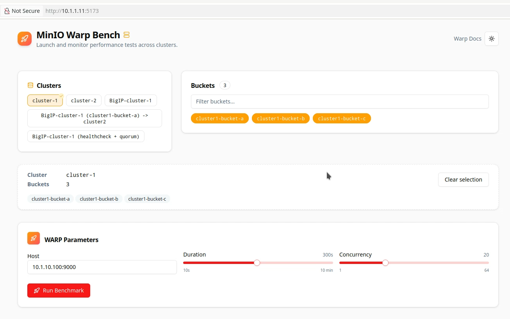
.. |lab005| image:: _static/lab1-005.png
   :width: 800px
.. |lab006| image:: _static/lab1-006.png
   :width: 800px
.. |lab007| image:: _static/lab1-007.png
   :width: 800px
.. |lab008| image:: _static/lab1-008.png
   :width: 800px
.. |lab009| image:: _static/lab1-009.png
   :width: 800px
.. |lab010| image:: _static/lab1-010.png
   :width: 800px
.. |lab011| image:: _static/lab1-011.png
   :width: 800px
.. |lab012| image:: _static/lab1-012.png
   :width: 800px
.. |lab013| image:: _static/lab1-013.png
   :width: 800px

.. |lab015| image:: _static/lab1-015.png
   :width: 800px
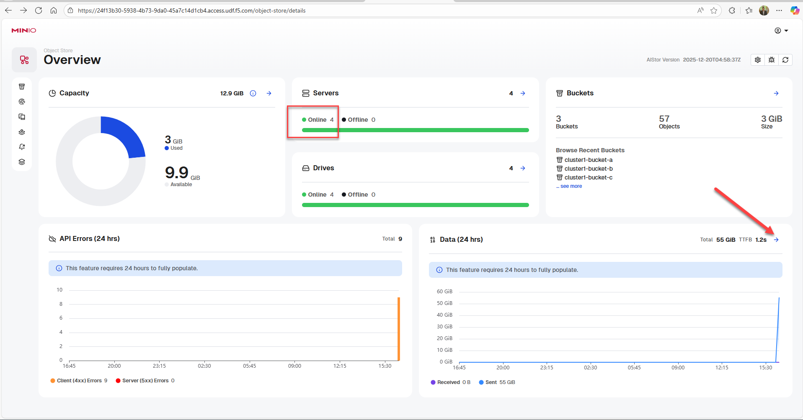
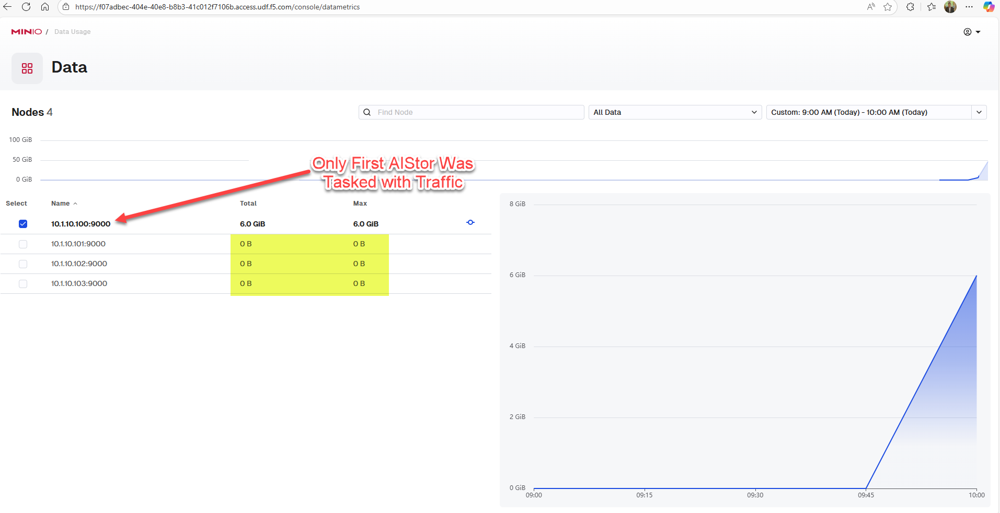
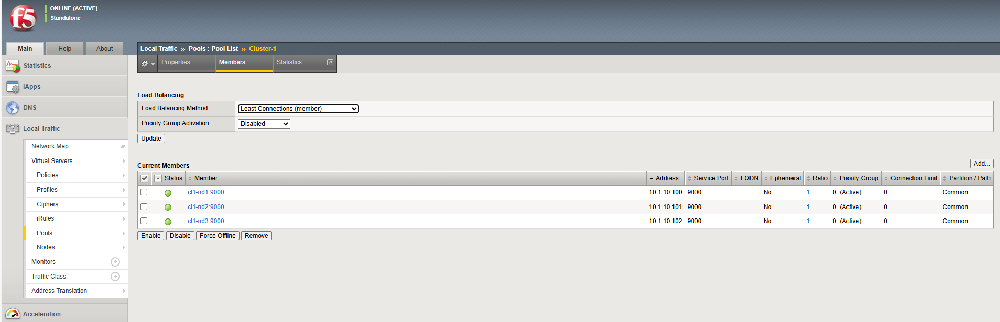
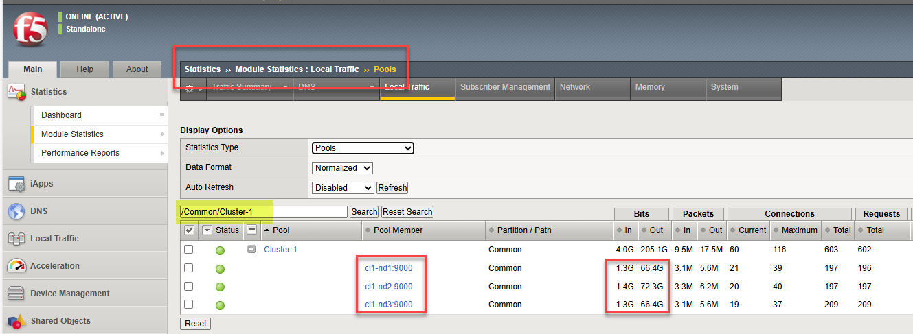
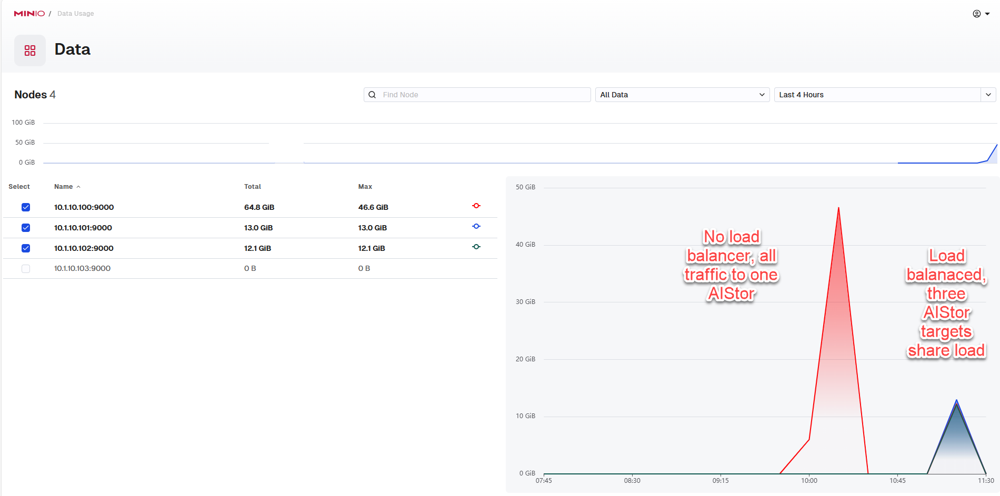
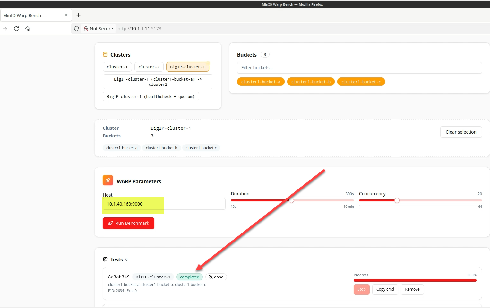
.. |lab022| image:: _static/lab1-022.png
   :width: 800px
.. |lab023| image:: _static/lab1-023.png
   :width: 800px
.. |lab024| image:: _static/lab1-024.png
   :width: 800px
.. |lab025| image:: _static/lab1-025.png
   :width: 800px
.. |lab026| image:: _static/lab1-026.png
   :width: 800px
.. |lab027| image:: _static/lab1-027.png
   :width: 800px
.. |lab028| image:: _static/lab1-028.png
   :width: 800px
.. |lab029| image:: _static/lab1-029.png
   :width: 800px
.. |lab030| image:: _static/lab1-030.png
   :width: 800px
.. |lab031| image:: _static/lab1-031.png
   :width: 800px
.. |lab032| image:: _static/lab1-032.png
   :width: 800px
.. |lab033| image:: _static/lab1-033.png
   :width: 800px
.. |lab034| image:: _static/lab1-034.png
   :width: 800px
.. |lab035| image:: _static/lab1-035.png
   :width: 800px
.. |lab036| image:: _static/lab1-036.png
   :width: 800px
.. |lab037| image:: _static/lab1-037.png
   :width: 800px
.. |lab038| image:: _static/lab1-038.png
   :width: 800px
.. |lab039| image:: _static/lab1-039.png
   :width: 800px
.. |lab040| image:: _static/lab1-040.png
   :width: 800px
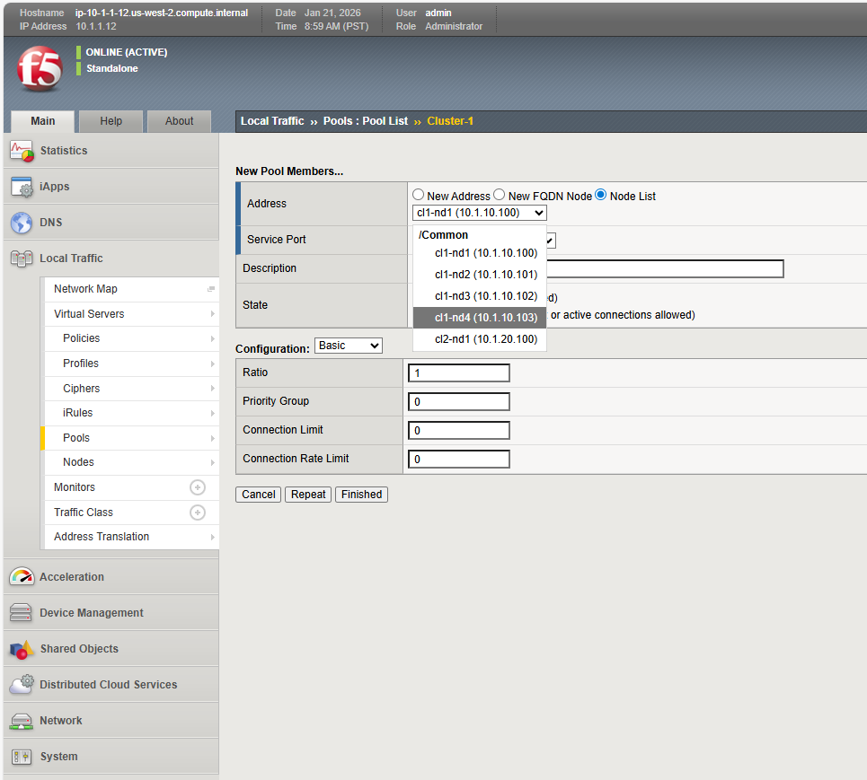
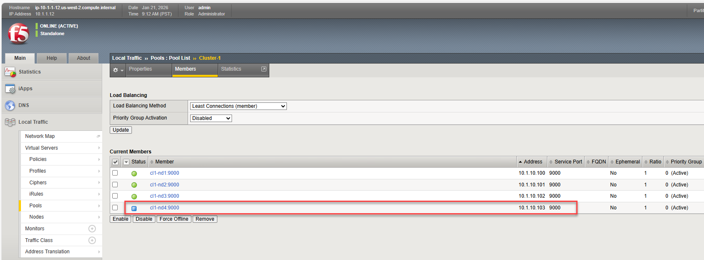
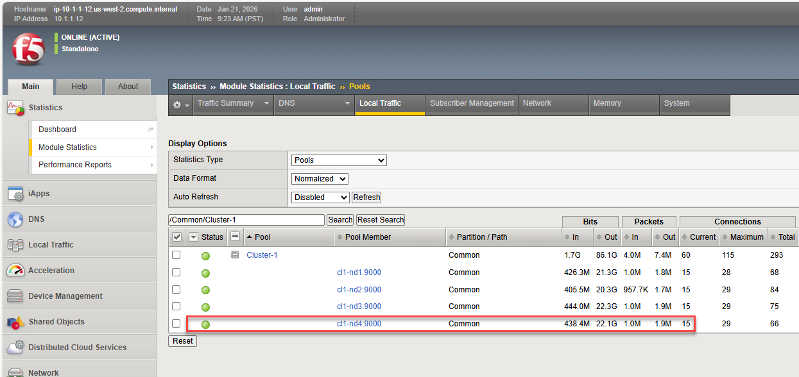
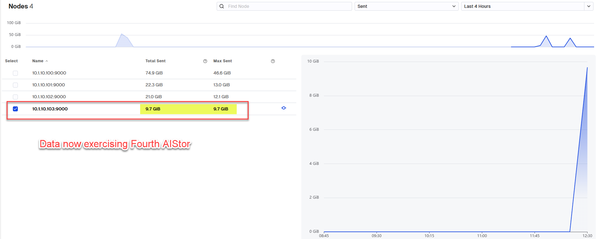
.. |lab045| image:: _static/a_ast_overview_charts.png
   :width: 800px
.. |labend| image:: _static/labend.png
   :width: 800px
